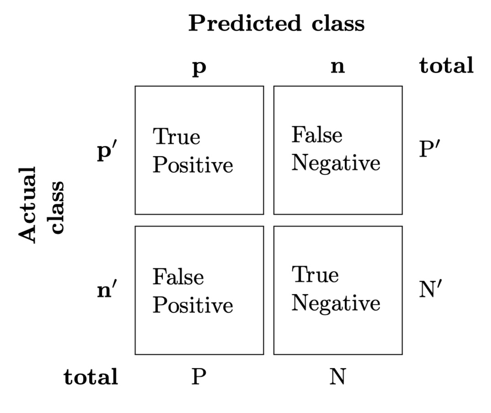

---

Deck: Deep Learning 2

Tags: neural-nets machine-learning

<!--ID:1652444566225-->
1. Sigmoid Function
>$\sigma: \mathbb{R} \rightarrow(0,1)$
>$\sigma(z)=\frac{1}{1+e^{-z}}$

<!--ID:1652444566226-->
2. Contigency table
> 

<!--ID:1652447550211-->
3. Accuracy
> Measures how often the classifier is correct.
> $\frac{tp+tn}{N}$

4. Missclassification rate
> States how often the classifier was wrong.
> $\frac{fp+fn}{N}$

---
